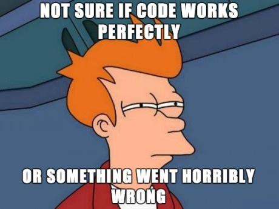

# magicksquares

This little program generates *magick squares* with an odd number of rows and columns.
It's written in the D programming language.

The kind of output generated is like this:
[3 X 3]
---------------------------
[   8][   1][   6]
[   3][   5][   7]
[   4][   9][   2]
---------------------------

## Testing

I Should do more testing apart from using more functional style...

